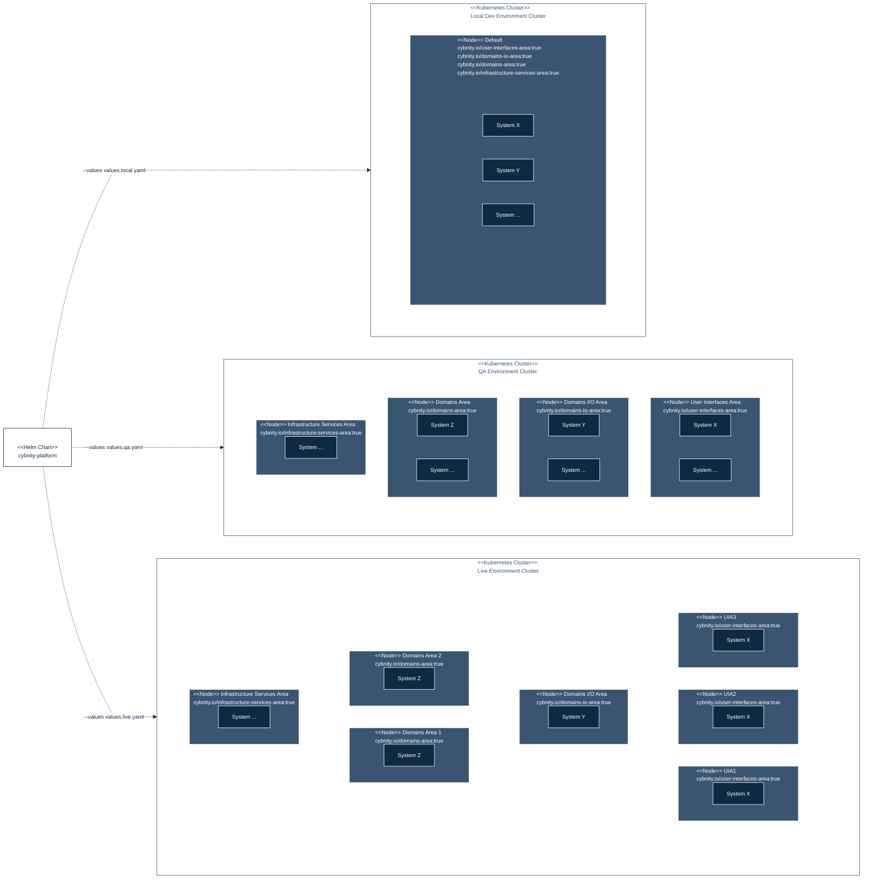
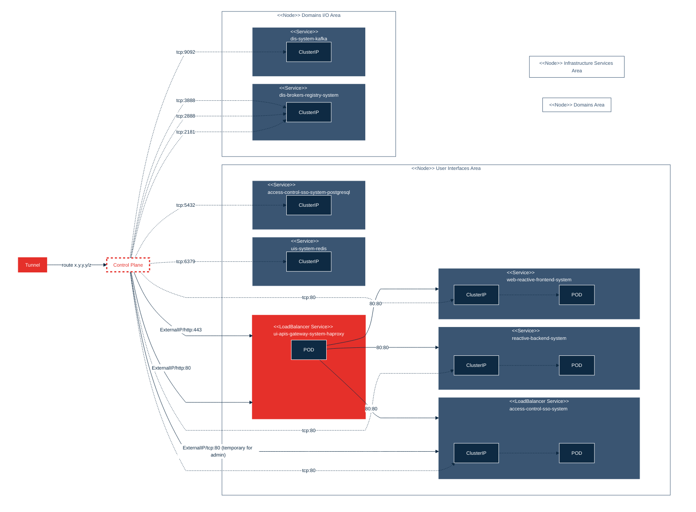

## PURPOSE
Presentation of the projects dedicated to manage the provisioning and orchestration of delivered CYBNITY module versions.

The management of several types of modules is approached with an integrated vision that mix the best practices proposed by each used tool, into a global common and compatible architecture of the source codes projects.

To avoid risks (e.g large modules are slow, insecure, difficult to understand/test/review), some modularity requirements are respected for development and maintenance at a Production-grade infrastructure modules:
- Small modules
- Composable modules
- Testable modules
- Releasable modules

Several assembly projects are managed regarding the packaging of modular and deployable systems relative to independent and autonomous containerized systems of security features, and/or integrated applicative modules (e.g aggregation of CYBNITY domain's features).

# SYSTEM PROJECTS
The CYBNITY systems are application components (e.g web backend app, standalone executable java app) that are containerized as __deployable and executable Systems__.

## PROVISIONED APPLICATION SYSTEMS PROJECTS
Perimeter: the deployable application components (e.g Java autonomous application) are containerized as Docker images automatically generated by the Maven tool (e.g during build process supported by the Commit stage). Each application component (initiallly packaged as an executable binary like Jar app or Node.js app) is encapsulated into a dedicated Docker image.

Project type: Maven or Node.js implementation structures; dockerization auto-generated (e.g Dockerfile generation, image template tagging, push to Docker repository) via Maven plugin.

Description: each deployable application provisioning is defined via Helm chart and sub-charts.
- [reactive-messaging-gateway](charts/reactive-messaging-gateway): Helm provisioning project of containerized web backend server.
- [web-reactive-frontend](charts/web-reactive-frontend): Helm provisioning project of containerized web frontend server.

## REUSABLE PROVISIONING SYSTEM PROJECTS
Perimeter: some infrastructure third-party software (e.g Zookeeper application) are available on the market as template of provisioning helping to quickly customize the runtime (provisioning of pre-configured Docker image) into a Kubernetes platform. Some infrastructure components are reused by CYBNITY as infrastructure systems with customization of the prepared templates of their images helmization.

Project type: Helm implementation structures.

Description: several generic infrastructure projects required by the CYBNITY implementation architecture are managed.
- [users-interactions-space](charts/users-interactions-space): bitnami Helm project of Redis image provisioning, customized for the CYBNITY needs (e.g implementation of collaboration space in UI area). This provisioning project is deployable and is supported by a `bitnami/redis` version including `7.0.8-debian-11-r0` operating system libraries. This implementatio (hosted on [ArtifactHUB](https://artifacthub.io/packages/helm/goauthentik/redis)) is currently used to reduce the maintenance effort of a dedicated Helm project based on the `infrastructure\integration\system\users-interactions-broker` docker image project.
- [domains-interactions-space](charts/domains-interactions-space): bitnami Helm project of Kafka image provisioning, customized for the CYBNITY needs (e.g implementation of collaboration space in Domains I/O area). This provisioning project is deployable and is supported by a `bitnami/kafka` version including `3.3.2-debian-11-r0` operating system libraries. This implementatio (hosted on [ArtifactHUB](https://artifacthub.io/packages/helm/bitnami/kafka)) is currently used to reduce the maintenance effort of a dedicated Helm project based on the `infrastructure\integration\system\domains-interactions-broker` docker image project.
   - [dis-brokers-registry-system](charts/domains-interactions-space/charts/zookeeper): included sub-project of Zookeeper image provisioning, customized for the CYBNITY needs (e.g included as implementation of Kafka brokers registry). This provisioning project is deployable and is supported by a `bitnami/zookeeper` version including a `3.8.0-debian-11-r74` operating system libraries. This implementation (hosted on [ArtifactHUB](https://artifacthub.io/packages/helm/riftbit/zookeeper)) is currently used to reduce the maintenance effort of a dedicated Helm project based on the `framework\services-registry-container` docker image project.

- [Keycloak server](/charts/access-control-sso): bitnami Helm project of Keycloak image provisioning, customized for the CYBNITY needs. This provisioning project is deployable and is supported by a `bitnami/keycloak 13.4.0` version hosted on `20.0.5-debian-11-r4` operating system version, and including a `postgresql 12.2.1` database version deployment. This implementation (hosted on [GitHUB](https://github.com/bitnami/charts/tree/main/bitnami/keycloak)) is currently used to reduce the maintenance effort of a dedicated Helm project.
   - Installation from command line: `helm install access-control-sso-system -f access-control-sso/values.yaml bitnami/keycloak`

- [ui-apis-gateway](charts/ui-apis-gateway): bitnami Helm project of NGINX and Ingress controller image provisioning, customized for the CYBNITY needs.

## PROVISIONED SYSTEMS ARCHITECTURE
### K8S cluster nodes setting
To deploy the CYBNITY Defense Platform according to a type of target environment, the available and defined K8s Nodes included by a K8s cluster shall be labelled for support of the CYBNITY components installation model.

See the Foundation project about the implementations-line sub-directory README.md for more detail on each layer's mission.

A cluster setting can be performed by DevOps responsible, or by automation system (e.g Terrafom project implementing the IaC model) that ensure a start of K8s cluster compatible for CYBNITY platform deployment that include labelled nodes according to the quantity of Nodes constitying the cluster.

Each defined Node or set of Nodes (e.g multiple nodes supporting a scalability model on a specific CYBNITY target layer) shall declare its contribution to one or multiples layers via:
- set label __cybnity.io/user-interfaces-area__ equals to __true__ to node(s) constituying the layer where users interactions are executed
- set label __cybnity.io/domains-io-area__ equals to __true__ to node(s) constituying the layer where processing of API per domain are treated
- set label __cybnity.io/domains-area__ equals to __true__ to node(s) constituying the layer where the applicative domains processes are performed
- set label __cybnity.io/infrastructure-services-area__ equals to __true__ to node(s) constituying the layer where transversal infrastructure services are provided

For example and helping the cluster setting by a developer or DevOps, see [cluster-node-labels-add.sh](../cluster-node-labels-add.sh) file that realize the labelling of 4 nodes in a distribution model that add label one each of 4 nodes as "one node per layer".

#### Distribution Strategy of each CYBNITY system
The distribution of systems is automated according the labels declared by any existing Node into the deployed cluster.
Each CYBNITY component is configured by a Helm Chart with `NodeSelector` declaration (e.g see `values.yaml` files) that identify on with type of Node the component should be installed and started by the K8s Control Plane.

For example, the reactive-messaging-gateway system is provisionned to be deployed on the Node constitying an isolated cluster part named `user-interfaces-area` with the directive indicated into its [value.yaml file](/charts/reactive-messaging-gateway/values.yaml) equals `true` that means _"install this element on a node that have a defined label named cybnity.io/user-interfaces-area equals to true"_:

```
...
nodeSelector:
  cybnity.io/user-interfaces-area: "true"
...
```

### Provisioning configuration about components installation
The deployable systems configuration via Helm charts allow to deploy the platform components onto several typologies of clusters which can be based on unique node (e.g developer's workstation supported by a Minikube stack providing a Profile with only one Node) or can be based on multiples node (e.g test environment allowing quality control activities supported by a cloud K8S instance providing 4 nodes with each one dedicated to a layer; production environment supported by a cloud K8 instance providing a cluster of 3 nodes on a layer, 2 nodes on another one etc...).

The dynamic search of Node labels by the system during their initialization, ensure the automatic detection of node(s) where the system shall be started.



### Channels Configuration
Multiple channels are activated between systems constituying a standard CYBNITY Defense Platform deployed into a standard K8s cluster.



# CYBNITY PLATFORM USAGE
## VPN tunnel to K8s cluster
When cluster is started, the CYBNITY access via browser is possible after start of a VPN tunnel.

To start VPN tunnel:
```shell
minikube tunnel -p local-env4
```

## SSO server configuration
The access to Keycloak configuration is allowed via url externally exposed by the deployed APIs gateway (HAProxy service) on port 80 according to `http:<<external ip>>/auth`.
